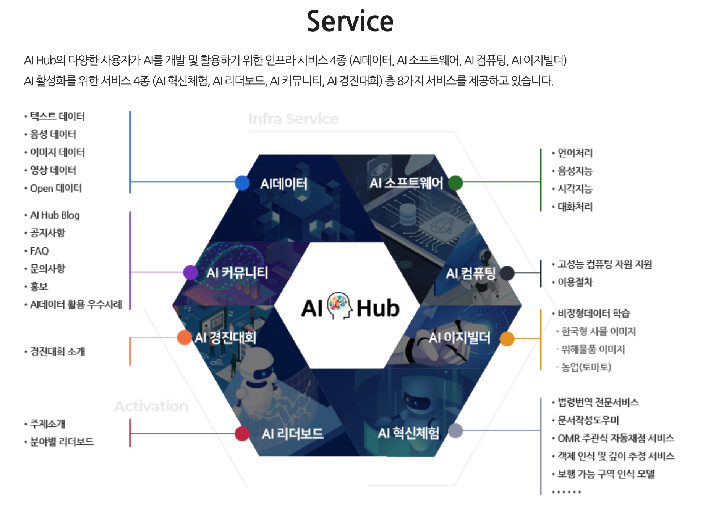
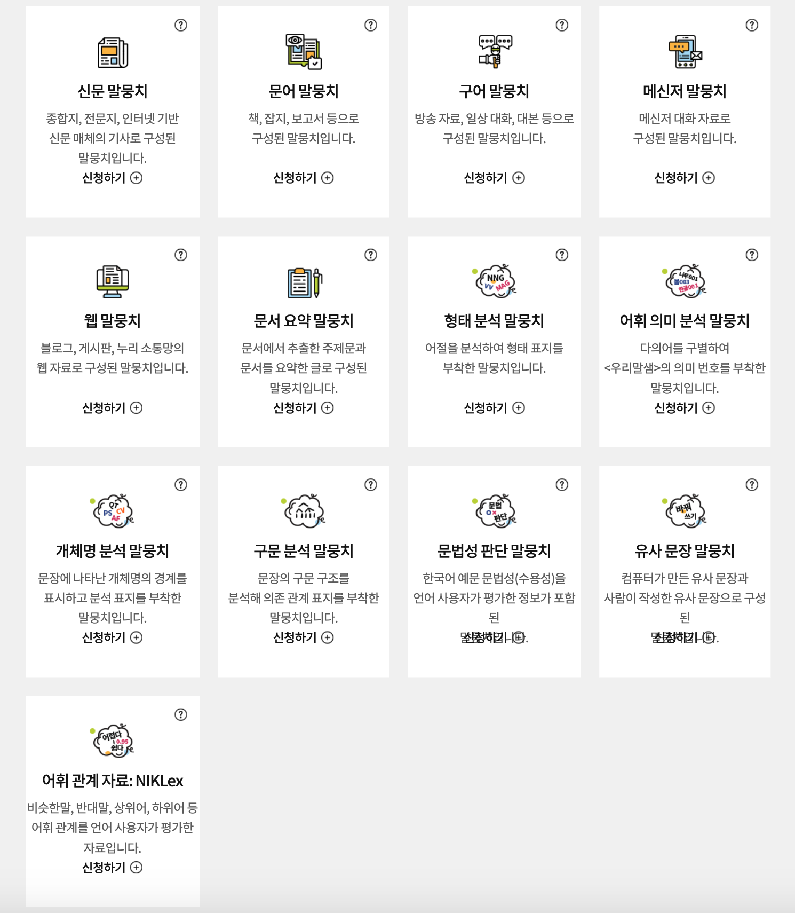

# AwesomeKorean_Data

- 2020년까지 많은 데이터가 구축되었다. 그 중에서 비교적 대부분의 사람들이 접근할 수 있는 오픈 데이터를 정리하였다. 구할 수 있는 모든 데이터를 쏟아 부어서 end to end로 모델을 만들어 보겠다는 포부를 가진 분들의 진입을 쉽게하기 위한 목적이고, 정교한 데이터 구축을 위해서는 이후에 어떠한 데이터가 필요한지를 살펴보기 위한 과정이다.            

- 12월 15일 첫번째 버전을 만들었고 이후 박조은님의 코멘트 그리고 2020년 8월 21일 @warnikchow님의 다양한 기여와 의견을 반영하여 수정하였고 2020년 10월 18일 [메인 레포](https://github.com/ko-nlp/Open-korean-corpora)를 이동하였다. 메일 레포에서는 영어 버전을, 이 곳에는 한국어로 데이터 링크와 약간의 설명을 추가하여 두 가지 버전으로 운영 중이다.   

- Natural language processing의 각 분야에 대한 자료 정리는 다음 링크를 참고     [Awesome-Korean-NLP](https://github.com/datanada/Awesome-Korean-NLP)   

- 다양한 전처리 및 다운로더를 포함한 데이터 링크는 다음을 참조 [https://ratsgo.github.io/embedding/preprocess.html](https://ratsgo.github.io/embedding/preprocess.html)      

- 코퍼스 패키지에 많은 관심이 필요합니다! 웹에 공개되어 있는 한국어 텍스트 데이터들을 손쉽게 로딩하고, 이를 이용하여 모델링한 후 evaluation 까지 편하게 수행하는 / 즉 한국어 텍스트 데이터를 위한 huggingface.nlp 작업 중인 페이지는 다음을 참조, [ko-nlp](https://github.com/ko-nlp/Korpora)
                                    
# Open Datasets

- Commercially available(com), academic use only(Academia), unknown(unk)
- Redistribution is possible with or without modification, if neither, or unknown (rd, rd/mod-x, no, unk)  
- Internationally available publication(inter) 

|No.|Dataset|Typical Usage|Provider|Docu.|License|Volume|Goal|Lang.|
|:---:|:---:|:---:|:---:|:---:|:---:|:---:|:---:|:---:|
|1|[KAIST Morpho-Syntactically Annotated Corpus](http://semanticweb.kaist.ac.kr/home/index.php/KAIST_Corpus)|형태분석|Academia|art|acad/no|70M (w)| - |ko|
|2|[KAIST Korean Tree-Tagging Corpus](http://semanticweb.kaist.ac.kr/home/index.php/KAIST_Corpus)|구문분석|Academia|inter|acad/no|30K (s)|-|ko|
|3|[UD Korean KAIST](https://github.com/emorynlp/ud-korean)|의존구문분석|Academia|inter|acad/rd|27K (s)|-|ko|
|4|[PKT-UD](https://github.com/emorynlp/ud-korean)|의존구문분석|Academia|inter|acad/no|5K (s)|-|ko|
|5|[KMOU NER](https://github.com/kmounlp/NER)|개체명인식| Academia|art|acad/rd|24K (s)|-|ko|
|6|[AIR x NAVER NER](http://air.changwon.ac.kr/?page_id=10)|개체명인식|Competition|doc|acad/no|90K (s)|-|ko|
|7|[AIR x NAVER SRL](http://air.changwon.ac.kr/?page_id=14)| 의미역 결정(Semantic Role Labeling)|Competition|doc|acad/no|35K (s)|-|ko|
|8|[KorNLI](https://github.com/kakaobrain/KorNLUDatasets)|자연처 추론(Natural Language Inference)|Industry|inter|com/rd |1,000K (p)|-|ko|
|9|[KorSTS](https://github.com/kakaobrain/KorNLUDatasets)|유사문장탐지(Semantic Textual Similarity)|Industry|[inter](https://arxiv.org/abs/2004.03289)|com/rd|8,500 (p)|-|ko |
|10|[ParaKQC](https://github.com/warnikchow/ParaKQC)|유사문장판별(STS)|Academia|inter|com/rd|540K (p)|-|ko|
|11|[NSMC](https://github.com/e9t/nsmc)|감성분석(Sentiment analysis)|Academia|doc|com/rd|150K / 50K (s)|-|ko|
|12|[BEEP!](https://github.com/kocohub/korean-hate-speech)|혐오표현탐지(Hate speech detection)|Academia|inter|com/rd |8K / 500 / 1,000 (s)|-|ko|
|13|[3i4K](https://github.com/warnikchow/3i4k)|화행분류(Speech act classification) |Academia |inter|com/rd |55K / 6K (s)|-|ko|
|14|[KorQuAD 1.0](https://korquad.github.io/)|질의응답(QA)|Industry|inter|com/rd (mod-x)|60K / 5K / 4K (p)|-|ko|
|15|[KorQuAD 2.0](https://korquad.github.io/)|질의응답(QA)|Industry|art|com/rd (mod-x)|80K / 10K / 10K (p)|-|ko|
|16|[Sci-news-sum-kr](https://github.com/theeluwin/sci-news-sum-kr-50)|문서요약(Summarization)|Academia|doc|acad/rd|50 (p)|Eval|ko|
|17|[sae4K](https://github.com/warnikchow/sae4k)|문서요약(Summarization)|Academia|inter|com/rd|50K (p)|-|ko|Structured argument extraction for Korean|
|18|[Korean Parallel Corpora](https://github.com/jungyeul/korean-parallel-corpora)|병렬코퍼스(MT)|Academia|inter|com/red(mod-x)|97K (p)|-|ko, en|-|
|19|[KAIST Translation Evaluation Set](http://semanticweb.kaist.ac.kr/home/index.php/Evaluateset2) |병렬코퍼스(MT)| Academia|doc|acad/no|3K (p)|Eval|ko, en|
|20|[KAIST Chinese-Korean Multilingual Corpus](http://semanticweb.kaist.ac.kr/home/index.php/Corpus9) |병렬코퍼스(MT) |Academia|doc|acad/no|60K (p)|-|ko, zh|
|21|[Transliteration Dataset](https://github.com/muik/transliteration)|영어-한글 표기 변환기(Transliteration)|Academia |doc|com/rd |35K (p)|-| ko, en|
|22|[KAIST Transliteration Evaluation Set](http://semanticweb.kaist.ac.kr/home/index.php/Evaluateset3)|영어-한글 표기 변환기(Transliteration)|Academia|doc|acad/no|7K (p)|Eval|ko, en|
|23|[SIGMORPHON G2P](https://sigmorphon.github.io/sharedtasks/2020/task1/) |다중언어의 자소를 음소로 변환(G2P conversion)|Competition |inter|com/rd |3,600 / 450 / 450 (p) |-|ko, en, hy, bg, fr, ka, hi, hu, is, lt, el|
|24|[PAWS-X](https://github.com/google-research-datasets/paws/tree/master/pawsx) | 유사문장탐지(Paraphrase detection) |Industry|inter|com/rd |5K / 2K / 2K (p)|-|ko, fr, es, de, zh, ja|-|
|25|[TyDi-QA](https://github.com/google-research-datasets/tydiqa)|QA|Industry|inter|com/rd |11K / 1,698 / 1,722 (p)|-|ko, en, ar, bn, fi, ja, id, sw, ru, te, th|
|26|[XPersona](https://github.com/HLTCHKUST/Xpersona) |다중언어 대화(Dialog) |Academia |[inter](https://arxiv.org/abs/2003.07568) |com/rd |299 (d) / 4,684 (s)|- |ko, en, it, fr, id, zh, ja|
|27|[KSS](https://github.com/Kyubyong/kss) |한국어 1인 발화(ASR)|Academia|doc|acad/rd|12+ (h) / 13K (u) / 1 speaker |-|ko |
|28|[Zeroth](https://github.com/goodatlas/zeroth) |Kaldi 기반의 음성 인식(ASR)|Industry|doc|com/rd|51+ (h) / 27K (s) / 46K (u) / 181 speakers|-|ko|
|29|[ClovaCall](https://github.com/clovaai/ClovaCall)|음성인식(ASR)|Industry|inter|acad/no|80+ (h) / 60K (u)/ 11K speakers|-|ko|
|30|[Pansori-TedXKR](https://github.com/yc9701/pansori-tedxkr-corpus)| TEDx음성인식(ASR)|Academia|inter|acad/rd / (mod-x)|3+ (h) / 3K (u)/ 41 speakers|-|ko|
|31|[ProSem](https://github.com/warnikchow/prosem)|의미를 구별하는 운율 요소(SLU)|Academia|inter|com/rd|6+ (h) / 3,500 (s) / 7K (u) / 2 speakers|-|ko|

## 기타 주요 데이터

|번호|데이터 종류| 데이터 설명|          
|:---:|:-----------------:|:-----------------:|
|1.|[한국 정치인 뉴스 데이터 세트](https://github.com/lovit/politician_news_dataset)|-|
|2|[청와대 국민청원](https://www1.president.go.kr/petitions) 사이트의 [만료된 청원](https://www1.president.go.kr/petitions?only=finished) 데이터 모음| [:octocat:](https://github.com/akngs/petitions)|-|
|3|[공공데이터포털 뉴스빅데이터](https://www.data.go.kr/dataset/15012945/fileData.do) |뉴스 데이터 'Kinds' 기반 분석 자료, 기사 메타 제공|      
|4|[챗봇용 대화 응답 세트](https://github.com/songys/Chatbot_data)|챗봇용 응답 쌍과 긍부정 태깅|
|5|[영화추천시스템을 위한 데이터 세트](https://github.com/lovit/kmrd)|Synthetic dataset for recommender system created with Naver Movie rating system|
|6|[욕설데이터 세트](https://github.com/2runo/Curse-detection-data)|문장의 욕설 여부를 분류한 데이터 세트|
|7|[학습용 뉴스 댓글 데이터](https://www.kaggle.com/junbumlee/kcbert-pretraining-corpus-korean-news-comments)|BERT 모델과 학습에 이용한 11.62G 데이터를 모두 공개|   
|8|[AMR](https://github.com/choe-hyonsu-gabrielle/korean-amr-corpus)|[문서요약에 대한 지침](https://github.com/choe-hyonsu-gabrielle/korean-amr-guidelines)과 데이터 세트|
|9|[네이버쇼핑, Steam 플랫폼 리뷰 데이터](https://github.com/bab2min/corpus/tree/master/sentiment)|감성분석(Sentiment Analysis)을 위한 제품 별, 게임 별 별점과 후기를 수집한 데이터셋|

# 국가적 규모에서 구축한 데이터

|번호|데이터 종류| 데이터 설명|
|:---:|:-----------------:|:-----------------:|         
|1| [우리말샘](https://opendict.korean.go.kr/main)| 이 사전에 대한 설명 [:octocat:](https://github.com/songys/Dictionaries) : 다양한 어휘와 유의어 정보 등을 얻을 수 있는 대사전 : 로그인 후 전체 사전 데이터 다운로드 가능| |      
|2| [NIA 사전](https://kbig.kr/portal/kbig/knowledge/files/bigdata_report.page?bltnNo=10000000016451)|묻지도 따지지도 않고 다음 링크에서 엑셀로 다운로드 가능 |  
|3| [국립국어원 언어정보나눔터](https://ithub.korean.go.kr/user/total/database/corpusManager.do )| 로그인 후 세종2007 코퍼스나 낭독체 음성 파일 등도 다운로드 가능, 다운 받을 때 간단한 서약에 체크만 하면 되는데 자료의 크기를 작게 나누어 놓아서 여러번 체크해야 한다는 것이 단점 |  
|4| [AIHub](http://aihub.or.kr/)| 텍스트와 음성 멀티모달까지 가장 광범위한 데이터, 로그인 및 사용 목적과 기간을 명시한 사용 신청서 작성 후 허가 메일이 오면(하루 정도 걸린다) 다운로드 가능 |   

   
|번호|데이터 종류| 데이터 설명|            
|:---:|:-----------------:|:-----------------:|         
|5|[국립국어원 모두의 말뭉치](https://corpus.korean.go.kr/)| 다양한 분석 말뭉치(형태소 분석과 구문 분석 말뭉치 등), 다양한 도메인의 말뭉치(문어, 신문, 구어, 웹), 자연어 추론을 위한 말뭉치(유사 문장) 등 다양한 데이터들이 체계적으로 구축되어 있다. 로그인, 메일 인증을 거쳐 데이터를 신청할 수 있고 다운로드 받기 위해서는 연구과제명과  수행기관, 약정 기간 등이 필수 입력 요소이다. |

- 딥러닝이 블랙박스 모델이라고 불리고 있음에도 불구하고 다양한 모델링과 튜닝을 하는 모델러와 데이터 구축에서 서비스까지  뚝딱뚝딱 마법사처럼 만들어 내고 계신 SW 개발자 여러분, 다양한 feature를 찾아내 분석할 수 있는 모든 방법론으로 설명해 주고 계신 분석가, 사람의 언어와 기계의 언어를 이해하려고 노력하는 코퍼스 언어학자 등 남들이 삽질이라고 영역에서 놀라운 창조력을 발휘해 내시는 분들께 감사의 마음과 큰 박수를 보낸다. 

